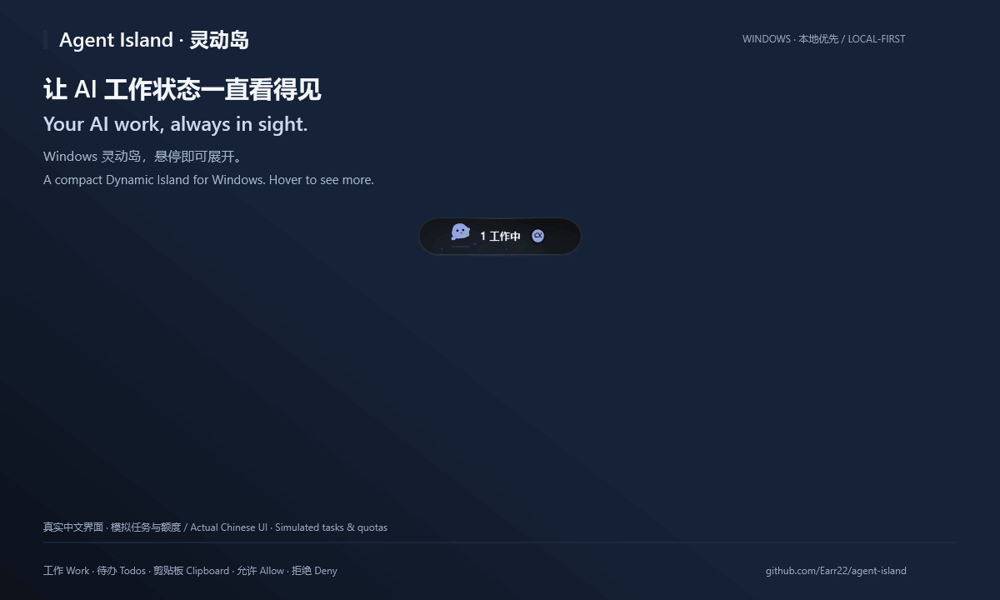
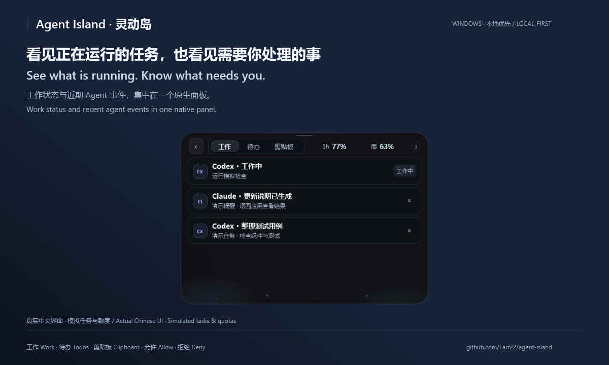
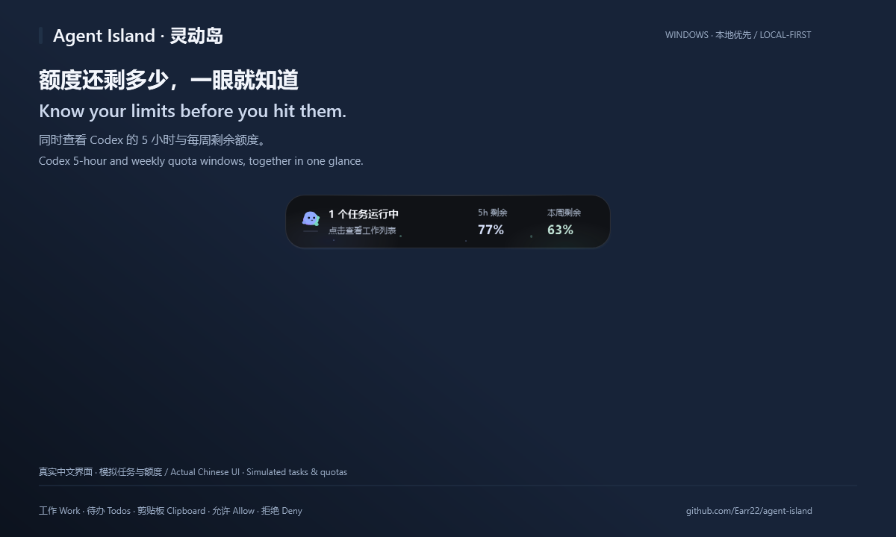
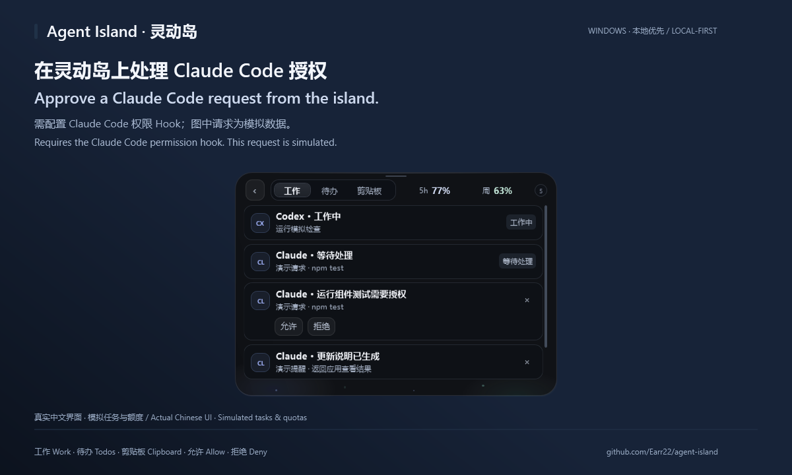

# Agent Island

**Your AI coding agents, in a Windows Dynamic Island.**

[Download for Windows](https://github.com/Earr22/agent-island/releases/latest) · [中文说明](README.zh-CN.md) · [Report a bug](https://github.com/Earr22/agent-island/issues/new/choose) · [Discussions](https://github.com/Earr22/agent-island/discussions)

See Codex work status and quota, catch agent reminders, and handle Claude Code permission requests without hunting through windows.



*Real native UI with simulated tasks, quota, and permission requests. All demo captions are bilingual (Chinese / English); the actual app interface is shown unchanged in Chinese, with an English control legend. [Watch or download the 15-second video](https://github.com/Earr22/agent-island/raw/refs/heads/main/docs/images/demo.mp4). No personal desktop or account data is recorded.*

Native WPF/.NET 8 · Windows 10/11 x64 · Portable · MIT · No telemetry

## Try it in three steps

1. **[Download the complete Windows ZIP](https://github.com/Earr22/agent-island/releases/download/v0.12.2/Agent-Island-Native-0.12.2-win-x64-self-contained.zip)** and its [SHA-256 checksum](https://github.com/Earr22/agent-island/releases/download/v0.12.2/Agent-Island-Native-0.12.2-win-x64-self-contained.zip.sha256). This is the recommended package; the .NET desktop runtime is included.
2. Verify the checksum and extract the **whole ZIP** into a writable folder. Keep the DLLs, runtime files, tray icon, and notification helper alongside the executable.
3. Run `AgentIsland.Native.exe`. Choose whether to enable clipboard history, then hover over the island to expand it and click to open the workspace.

No installer or administrator access is required. Codex Desktop monitoring works from local session records; Claude Code permission handling requires the [hook setup below](#claude-code). Other agents need their integration or the local API—process detection alone does not provide full task status.

**Safety:** release builds are not code-signed, so Windows SmartScreen may show an “Unknown publisher” warning. Verify the checksum before running; you can also [build from source](#run-from-source).

Already have the .NET 8 Desktop Runtime (x64)? The [smaller framework-dependent ZIP](https://github.com/Earr22/agent-island/releases/download/v0.12.2/Agent-Island-Native-0.12.2-win-x64-framework-dependent.zip) and both checksums are available in [Releases](https://github.com/Earr22/agent-island/releases/latest).

## What it looks like in use

### Know what is running—and what needs you

Codex lifecycle events distinguish active work from an idle process. Agent events collect completion, errors, and reminders in the Work page. Click a work item to return to the matching application; this does not guarantee the exact terminal tab or CLI subtask.



### Check both Codex quota windows at a glance

Hover to see the 5-hour and weekly remaining percentages. Reset times, source, and update time are available in the quota tooltip. Values come from local Codex records, not estimates; agents without supported quota data are marked unavailable.



### Answer Claude Code permission requests from the island

With the Claude Code permission hook configured, choose Allow or Deny in the panel and send the response back to Claude Code. **Codex approvals still need to be handled in Codex.**



### Small utilities, close at hand

- Work, Todos, and Clipboard pages in one compact workspace; todos include completion and a single-task timer.
- Top, bottom, left, right, or free placement, with edge snapping and auto-hide.
- Drag anywhere on the compact or hover island, including blank areas. In the workspace, use the slim top grip; moving the island keeps the panel open, and edge-snap confirmation stays within the screen.
- Optional memory-only clipboard history, up to 30 text or image items; optional Windows notification capture, off by default.
- Pixel companion states for working, resting, and attention; decorative animations stop when hidden.
- Codex lifecycle hooks, a Claude Code hook, an OpenCode example plugin, and a generic local REST API.

## Compatibility

| Tool | What is available | Setup |
| --- | --- | --- |
| Codex Desktop | Work/idle lifecycle, visible task text, 5-hour and weekly quota | Local session monitoring; optional lifecycle hooks |
| Claude Code | Hook-driven work events and permission decisions | Configure the Claude Code hooks |
| OpenCode | Events through the example plugin | Install the example plugin |
| Cursor / other local agents | Events through the REST API; matching application jump-back | Send events through an integration or script |

See [Agent integrations](#agent-integrations) for setup. Agent Island is an independent community project, not affiliated with or endorsed by OpenAI, Anthropic, Cursor, OpenCode, or Microsoft.

## Privacy at a glance

| Capability | Default | Storage / network behavior |
| --- | --- | --- |
| Clipboard history | First-run choice | Last 30 items in process memory only, with an image-memory bound; cleared on exit |
| Windows notification capture | Off | When enabled, reads visible toast text locally |
| Remove captured notifications | Off | Must be enabled separately |
| Todos | On demand | Stored at `%APPDATA%\agent-island\todos.json` |
| Codex session monitoring | On when Codex is present | Reads lifecycle events, prompt text, 5-hour and weekly quota/rate-limit fields locally; reasoning records are not parsed or displayed |
| Local event API | On | Binds to `127.0.0.1:17321`; browser cross-origin access is disabled |
| Telemetry / analytics | None | No usage analytics, tracking SDK, or cloud account |

The Codex prompt body is visible by default because it identifies the active task. Disable clipboard history at any time from the tray menu, which also clears its in-memory history. Existing settings and todos remain at `%APPDATA%\agent-island`. Read [PRIVACY.md](PRIVACY.md) for the complete data boundary.

Other local programs can read event/task text and submit decision responses through the API. Loopback-only access is not an authentication boundary.

## Upgrade from Electron

Version 0.12.0 rebuilds the application with native WPF and .NET 8. The released application no longer embeds Electron or Chromium. The previous Electron implementation remains in `src/` for reference and rollback.

Exit the Electron application before starting the native version; both use port 17321 and the same settings/todo directory. If an old shortcut or startup entry still launches Electron, update it to the native executable. The native tray menu can configure startup. The previous [v0.11.3 release](https://github.com/Earr22/agent-island/releases/tag/v0.11.3) remains available for rollback; exit the native app first.

The native version removes Send to Notion and currently shows quota windows without the previous Credits/context tooltip fields. Notification capture does not suppress Windows toast banners; configure Windows notification settings if you want island-only reminders.

## Run from source

Install the .NET 8 SDK on Windows, then:

```powershell
git clone https://github.com/Earr22/agent-island.git
cd agent-island
.\native\build.ps1
.\dist\native\AgentIsland.Native.exe
```

Development and validation:

```powershell
.\dist\native\AgentIsland.Native.exe --self-test --output=artifacts/native-self-test
.\dist\native\AgentIsland.Native.exe --diagnose --output=artifacts/native-diagnostics
.\native\build.ps1 -SelfContained -OutputDirectory artifacts/native-self-contained
```

The default build is framework-dependent and writes to `dist/native/`. See [native/README.zh-CN.md](native/README.zh-CN.md) for details. Node.js and Electron are needed only for optional icon regeneration and the legacy implementation.

### Reproduce the public demo

The screenshots and animation are rendered from the real WPF visual tree using synthetic fixtures, not a desktop recording. The renderer does not start session monitoring, clipboard capture, Windows notification capture, or an HTTP listener, and does not load normal settings or todos.

With .NET 8 SDK and Python with Pillow installed:

```powershell
.\scripts\render-showcase.ps1
```

Pass `-Dotnet` or `-Python` to select an existing runtime. MP4 encoding is optional: install `imageio-ffmpeg` in your chosen Python environment or pass `-Ffmpeg` with an existing encoder. Temporary frames and synthetic data stay in ignored `artifacts/`; only the reviewed media under `docs/images/` is public. Do not publish diagnostic logs or real session captures.

## Send an event in 30 seconds

With Agent Island running:

```powershell
.\scripts\agent-island.ps1 -Source codex -Type progress -Title "Checking the project" -Message "7 of 10 checks complete" -Progress 70
```

Or send JSON to the loopback API:

```http
POST http://127.0.0.1:17321/v1/events
Content-Type: application/json

{
  "source": "cursor",
  "type": "progress",
  "title": "Refactoring authentication",
  "message": "Running tests",
  "progress": 68,
  "taskId": "auth-refactor",
  "systemNotify": false
}
```

Supported event types are `working`, `progress`, `success`, `error`, `warning`, `notification`, and `decision`. The service keeps at most 120 recent events in memory and accepts request bodies up to 512 KB.

## Agent integrations

### Codex

Agent Island incrementally scans local Codex Desktop session files for lifecycle and quota records. `task_started` starts the work state and `task_complete` returns it to idle. Prompt text is used as the visible task label. `token_count` records provide the 5-hour and weekly quota windows and reset times. Reasoning records are ignored. The latest quota snapshot is also included in the loopback-only `/v1/state` response.

For lifecycle hooks, copy [`integrations/codex.hooks.example.json`](integrations/codex.hooks.example.json) to `~/.codex/hooks.json`, replace `PROJECT_PATH`, and trust it from Codex. Codex approval requests currently direct you back to Codex; Agent Island does not claim an approval it cannot send back.

### Claude Code

Merge the hooks from [`integrations/claude.settings.example.json`](integrations/claude.settings.example.json) into `~/.claude/settings.json` or a project `.claude/settings.json`. A `PermissionRequest` can wait for a decision in Agent Island and return the result to Claude Code.

### OpenCode and other agents

Copy [`integrations/opencode-plugin.example.js`](integrations/opencode-plugin.example.js) to your OpenCode plugin directory. Any local tool that can make an HTTP request can use the same API; see [`scripts/agent-island.ps1`](scripts/agent-island.ps1) for a minimal client.

## Roadmap

- Easier one-click integration setup.
- More explicit per-source privacy controls.
- Signed Windows releases when sustainable.
- Richer multi-agent timelines and decision routing.

Ideas and real-world integration reports are welcome in [Discussions](https://github.com/Earr22/agent-island/discussions).

## Contributing and security

Read [CONTRIBUTING.md](CONTRIBUTING.md) before opening a pull request. Please report vulnerabilities privately through [GitHub Security Advisories](https://github.com/Earr22/agent-island/security/advisories/new), not through a public issue.

## License

[MIT](LICENSE). Third-party runtime notices are described in [THIRD_PARTY_NOTICES.md](THIRD_PARTY_NOTICES.md).
