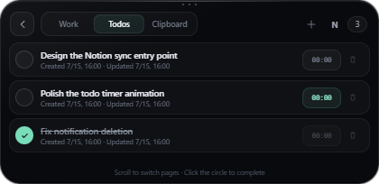

# Agent Island（灵动岛）

**面向 Codex 与其他 AI 编程 Agent 的 Windows 指挥中心。**

[English](README.md) · [下载 v0.10.3](https://github.com/Earr22/agent-island/releases/latest) · [反馈问题](https://github.com/Earr22/agent-island/issues/new/choose) · [参与讨论](https://github.com/Earr22/agent-island/discussions)



Agent Island 是一个本地优先的 Windows 动态岛：它把 Codex、Claude Code、OpenCode、Cursor 或自定义 Agent 的真实工作状态、完成提醒、错误和人工决策集中到一个置顶小窗口中。

这是首次正式公开版本。Agent Island 是独立社区项目，与 OpenAI、Anthropic、Cursor、OpenCode 或 Microsoft 不存在官方隶属或背书关系。

## 主要能力

- Codex Desktop 依据本机会话生命周期显示真实工作/空闲状态。
- Claude Code 权限 Hook 可在岛上直接允许或拒绝，并将结果返回 Claude Code。
- 支持顶部、底部、左右侧和自由位置，靠边吸附并自动隐藏。
- 工作、待办、剪贴板三页集中展示；点击工作条目可返回对应应用。
- 内置待办、完成状态和单任务计时器。
- 通用本地 REST API 与 PowerShell 客户端，方便其他 Agent 接入。
- Windows 通知捕获默认关闭，捕获后删除也默认关闭。

## 下载与安全提示

从 [Releases](https://github.com/Earr22/agent-island/releases/latest) 下载 `Agent-Island-Portable-0.10.3-x64.exe` 和 `.sha256` 文件。

首个公开版本尚未进行代码签名，因此 Windows SmartScreen 可能提示“未知发布者”。请先核对 SHA-256，或按英文 README 的步骤从源码构建。

## 隐私默认值

- 剪贴板历史默认开启，但首次启动会明确说明并允许立即关闭；只在进程内存保留最近 30 条，退出即清除。
- Codex 提示正文默认显示，用于识别正在执行的任务；不读取推理内容。
- Windows 通知捕获默认关闭；捕获后从通知中心删除必须单独开启。
- 本地 API 只监听 `127.0.0.1:17321`，并关闭浏览器跨域访问。
- 待办写入 `%APPDATA%\agent-island\todos.json`。
- 没有遥测、分析 SDK、云端账号或后台上传。

完整说明见 [PRIVACY.md](PRIVACY.md)。

## 从源码运行

需要 Windows 10/11 和 Node.js 20 或更高版本：

```powershell
git clone https://github.com/Earr22/agent-island.git
cd agent-island
npm ci
npm start
```

验证和构建：

```powershell
npm run check
npm test
npm run build:portable
```

Agent 接入示例与 HTTP API 说明见 [英文 README](README.md)。

## 反馈与贡献

普通问题请使用 [Issues](https://github.com/Earr22/agent-island/issues/new/choose)，想法和使用案例请发到 [Discussions](https://github.com/Earr22/agent-island/discussions)。安全漏洞请通过 [GitHub Security Advisories](https://github.com/Earr22/agent-island/security/advisories/new) 私下报告。

许可证：[MIT](LICENSE)。
